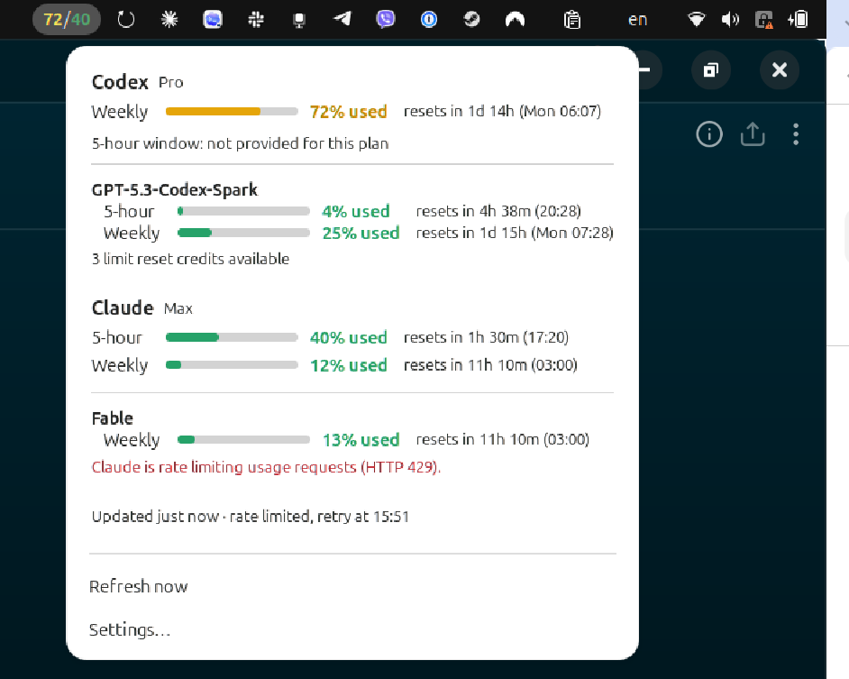
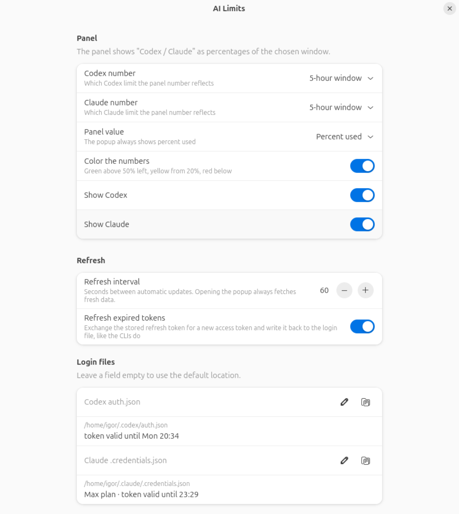

# AI Limits — Codex & Claude usage in the GNOME top bar

A GNOME Shell extension that shows how much of your **Codex** and **Claude**
usage limits is left, right in the top bar. Click it for the 5-hour and weekly
windows, their reset times, model-specific limits and credits.

The panel reads `72 / 40`: Codex first, then Claude, each a percentage of the
window you choose (left or used, your pick). The popup and the settings:

| Popup | Settings |
|:---:|:---:|
|  |  |

No extra sign-in and no accounts: the extension reads the login files that the
**Codex CLI** and **Claude Code** already keep on disk and asks the same usage
endpoints those tools use for their own `/status` and `/usage` commands.
Nothing is sent anywhere else.

## Requirements

| | |
|---|---|
| GNOME Shell | 48, 49 or 50 (tested on GNOME 50.1, Ubuntu 26.04, Wayland) |
| Codex | [Codex CLI](https://github.com/openai/codex) signed in with a ChatGPT account (`codex login`). Codex Desktop uses the same login file. |
| Claude | [Claude Code](https://docs.claude.com/en/docs/claude-code) signed in with a Claude subscription (`claude auth login`). |

You need at least one of the two. A service that is not signed in shows `!` in
the panel and an explanation in the popup; you can also hide it in the settings.

Only ChatGPT / Claude **subscriptions** have usage windows. API-key logins have
no limits to show and are not supported.

## Install

### From a release zip

Download `ai-limits@igor.lysenko.shell-extension.zip` from the
[releases page](https://github.com/ilysenko/ai-limits-gnome/releases), then:

```bash
gnome-extensions install --force ai-limits@igor.lysenko.shell-extension.zip
```

Log out and back in (GNOME on Wayland cannot load a new extension into a
running session), then enable it:

```bash
gnome-extensions enable ai-limits@igor.lysenko
```

The numbers appear in the top bar within a few seconds.

### From source

```bash
git clone https://github.com/ilysenko/ai-limits-gnome.git
cd ai-limits-gnome
make install      # symlinks extension/ into ~/.local/share/gnome-shell/extensions and compiles the schema
```

Log out and back in, then `make enable`.

### From extensions.gnome.org

[extensions.gnome.org/extension/10870/ai-limits](https://extensions.gnome.org/extension/10870/ai-limits/)
(pending review). Once approved, install it from that page or the Extension Manager app.

## Sign in once per service

**Codex.** Run `codex login` and sign in with your ChatGPT account. The token
lands in `~/.codex/auth.json` (or `$CODEX_HOME/auth.json`). Codex Desktop
shares this file, so if you use the desktop app you are already set.

**Claude.** Run `claude auth login` and sign in with the Claude account whose
limits you want to see. The token lands in `~/.claude/.credentials.json`
(or `$CLAUDE_CONFIG_DIR/.credentials.json`). Claude Desktop keeps its own
session in encrypted app storage that cannot be read, so the CLI login is
required even if you mostly use the desktop app; it is the same account and the
same limits.

Check which account a tool is signed in with:

```bash
codex login status
claude auth status
```

## Login files in other locations

Open the settings (`gnome-extensions prefs ai-limits@igor.lysenko`, or
*Settings…* in the popup) and fill in **Login files**:

- **Codex auth.json** — any file in the Codex CLI `auth.json` format.
- **Claude .credentials.json** — any file in the Claude Code `.credentials.json` format.

`~` and environment variables are expanded. Leave a field empty to use the
default location. The row underneath shows the resolved path, the plan found in
the file and the token expiry, so you can see at once whether the file is usable.

This is also how you track a second account: sign in to a separate Claude Code
profile and point the extension at it.

```bash
CLAUDE_CONFIG_DIR=$HOME/.claude-work claude auth login
# then set ~/.claude-work/.credentials.json in the settings
```

## Settings

| Setting | Meaning |
|---|---|
| Codex number / Claude number | Which window the panel number reflects: the 5-hour window, the weekly window, or whichever has less left. |
| Panel value | Percent left (default) or percent used. The popup always shows percent used, like the official usage pages. |
| Color the numbers | Green above 50 % left, yellow from 20 %, red below. |
| Show Codex / Show Claude | Hide a service you do not use. |
| Refresh interval | Seconds between automatic updates (default 60). Opening the popup always fetches fresh data. |
| Claude refresh interval | Claude's usage endpoint rate-limits frequent polling, so Claude is asked at most this often (default 180). *Refresh now* always asks immediately. |
| Refresh expired tokens | See below. |
| Login files | Custom paths, see above. |

## Token refresh

Access tokens expire (Claude after about 8 hours, Codex after about 10 days).
The CLIs refresh them only while they are running, so the extension does the
same thing they do: when a token has expired it exchanges the stored refresh
token for a new one and writes the result back to the login file, atomically and
with owner-only permissions. Refresh tokens are single use, so writing them back
is what keeps the CLI working afterwards.

If you would rather the CLIs own their files, turn off **Refresh expired
tokens**. The panel then shows `!` for that service until you run the CLI once.

## Where the numbers come from

| Service | Login file | Usage endpoint |
|---|---|---|
| Codex | `~/.codex/auth.json` | `GET https://chatgpt.com/backend-api/wham/usage` |
| Claude | `~/.claude/.credentials.json` | `GET https://api.anthropic.com/api/oauth/usage` |

These are the endpoints behind Codex's `/status` and Claude Code's `/usage`.
They are not publicly documented. A format change on the server side shows up as
an error line in the popup, not a crash.

Some ChatGPT plans have no 5-hour window on the main Codex limit and report only
a weekly one. In that case the panel falls back to the weekly window and the
popup says so. Model-specific limits (Codex Spark, Claude Opus / Sonnet weekly
caps and similar) are listed under the main windows.

## Privacy

- Usage requests go only to `chatgpt.com` and `api.anthropic.com`, using your own tokens.
- The extension keeps no copy of the tokens outside the login files.
- Nothing is logged except error messages.

## Troubleshooting

**`!` in the panel.** Open the popup; the error line under the service says
what is wrong (file not found, not signed in, token expired and refresh off,
rate limited). `claude auth status` / `codex login status` show the CLI side.

**Numbers do not match what I see on the website.** The extension reports the
account the CLI is signed in with. If the CLI is signed in to a different
account, sign in again or use a separate profile (see *Login files in other
locations*).

**Rate limited (HTTP 429).** The extension backs off automatically, doubling
the interval up to 30 minutes, and recovers on its own.

**Logs.** `journalctl -f -o cat /usr/bin/gnome-shell`

## Development

```bash
make test       # unit tests (gjs)
make install    # symlink into the user extensions directory
make enable     # enable in the running session (after a re-login)
make reload     # hot-swap the running extension; needs Looking Glass "Unsafe Mode"
make pack       # build dist/ai-limits@igor.lysenko.shell-extension.zip
```

`make reload` copies the source into a fresh directory and asks GNOME Shell to
unload the old copy and load the new one through `org.gnome.Shell.Eval`, which
only works while *Unsafe Mode* is on (`Alt+F2`, `lg`, *Flags* tab). Turn it off
when you are done.

Layout:

```
extension/            what gets packaged
  extension.js        panel button, popup, refresh scheduling
  prefs.js            settings window (libadwaita)
  lib/codex.js        Codex login file → usage
  lib/claude.js       Claude login file → usage
  lib/provider.js     shared error handling and token refresh
  lib/model.js        response parsing and formatting (pure functions)
  lib/http.js         fetch on top of libsoup 3
  lib/files.js        JSON read / atomic private write
  lib/auth.js         login file locations and token parsing
tests/                gjs unit tests, run with `make test`
fixtures/             sample API responses used by the tests
```

## License

MIT — see [LICENSE](LICENSE).
